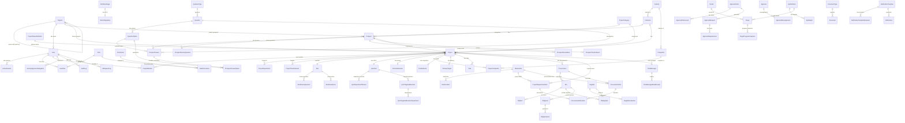

# ERD FINAL — Kinetic CRM

```mermaid
erDiagram
    %% ── ORGANIZATION & ACCESS ──
    OrgUnit ||--o{ OrgUnit : "parent-child (self-ref)"
    OrgUnit ||--o{ User : "has users"
    OrgUnit ||--o{ Prospect : "branch prospects"
    OrgUnit ||--o{ Project : "branch projects"
    User ||--o{ ActiveSession : "has sessions"
    User ||--o{ UserRole : "has roles"
    User ||--o{ ProjectMember : "member of"
    Role ||--o{ UserRole : "assigned to"
    Role ||--o{ RolePermission : "has permissions"
    Permission ||--o{ RolePermission : "assigned to"
    WorkflowStage ||--o| SlaConfiguration : "has SLA"

    %% ── MASTER DATA ──
    Customer ||--o{ Prospect : "has"
    Customer ||--o{ Project : "has"
    ProjectCategory ||--o{ Prospect : "categorizes"
    ProjectCategory ||--o{ Project : "categorizes"
    ProjectStatusDefinition ||--o{ Project : "defines status"
    Industry ||--o{ Customer : "industry of"
    Industry ||--o{ Competitor : "industry of"
    Competitor ||--o{ ProjectCompetitor : "competes in"
    QuestionType ||--o{ Question : "typed as"
    Question ||--o{ QuestionOption : "has options"
    Question ||--o{ ProspectAnswer : "answered by"
    Period ||--o{ Target : "period for"

    %% ── PROSPECT ──
    Prospect ||--o{ ProspectAnswer : "has answers"
    ProspectAnswer ||--o{ ProspectAnswerOption : "checkbox selections"
    QuestionOption ||--o{ ProspectAnswer : "selected option"
    QuestionOption ||--o{ ProspectAnswerOption : "selected in"
    Prospect ||--o{ ProspectReviewQuestion : "review questions"
    Prospect ||--o{ ProspectReviewNote : "review notes"
    Prospect ||--o{ ProspectTimelineEvent : "timeline"
    Prospect ||--o| Project : "converted to"

    %% ── PROJECT ──
    Project ||--o{ ProjectMember : "has members"
    Project ||--o{ ProjectDepartment : "scoped to"
    Project ||--o{ ProjectTimelineEvent : "timeline"
    Project ||--|| Rks : "has RKS"
    Project ||--|| LphsSios : "has LPHS"
    Project ||--o| PriceSubmission : "has pricing"
    Project ||--o{ ProjectCompetitor : "has competitors"
    Project ||--o| TenderResult : "has result"
    Project ||--o| DeliveryTarget : "has delivery"
    Project ||--o{ Task : "has tasks"
    Project ||--o{ Procurement : "has procurements"
    Project ||--o{ ProjectRequirementItem : "requires items"
    Project ||--o{ ChatMessage : "chat messages"

    %% ── RKS ──
    Rks ||--o{ RksReviewQuestion : "review questions"
    Rks ||--o{ RksReviewNote : "review notes"

    %% ── LPHS ──
    LphsSios ||--o{ LphsDepartmentReview : "department reviews"
    LphsSios ||--o{ LphsTargetedRevision : "targeted revisions"
    LphsTargetedRevision ||--o{ LphsTargetedRevisionDepartment : "targets depts"

    %% ── APPROVAL ──
    Approval ||--o{ ApprovalReassignment : "reassignments"
    ApprovalChain ||--o{ ApprovalChainLevel : "has levels"
    ApprovalChain ||--o{ ApprovalRequest : "generates"
    ApprovalRequest ||--o{ ApprovalRequestLevel : "has levels"
    User ||--o{ BackupApproverDelegation : "backup for"

    %% ── DOCUMENT ──
    DocumentType ||--o{ Document : "typed as"

    %% ── KPI ──
    KpiDefinition ||--o{ KpiWeight : "has weights"
    KpiDefinition ||--o{ Target : "has targets"
    Target ||--o{ TargetProgressSnapshot : "progress snapshots"

    %% ── NOTIFICATION ──
    NotificationTemplate ||--o{ NotificationTemplateRecipient : "has recipients"
    NotificationTemplate ||--o{ Notification : "generates"

    %% ── PROCUREMENT ──
    Procurement ||--o{ Rfq : "has RFQs"
    Procurement ||--o{ ProcurementItem : "has items"
    Rfq ||--o{ RfqItem : "line items"
    Rfq ||--o{ RfqSupplier : "invited suppliers"
    Rfq ||--o{ RfqQuote : "receives quotes"
    RfqQuote ||--o{ RfqQuoteItem : "quote lines"
    Supplier ||--o{ SupplierEvaluation : "evaluations"
    Supplier ||--o{ RfqSupplier : "invited to"

    %% ── ITEM / BOM ──
    MasterItem ||--o{ DealLineItem : "deal items"
    MasterItem ||--o{ ProjectRequirementItem : "project BOM"
    MasterItem ||--o{ ProcurementItem : "procurement items"
    ProjectRequirementItem ||--o{ ProcurementAllocation : "allocated to"
    ProcurementItem ||--o{ ProcurementAllocation : "allocates"

    %% ── CHAT ──
    ChatMessage ||--o{ ChatMessageReadReceipt : "read by"

    %% ── AUDIT ──
    User ||--o{ AuditLog : "audit trail"
    User ||--o{ AiRequestLog : "AI requests"
```
